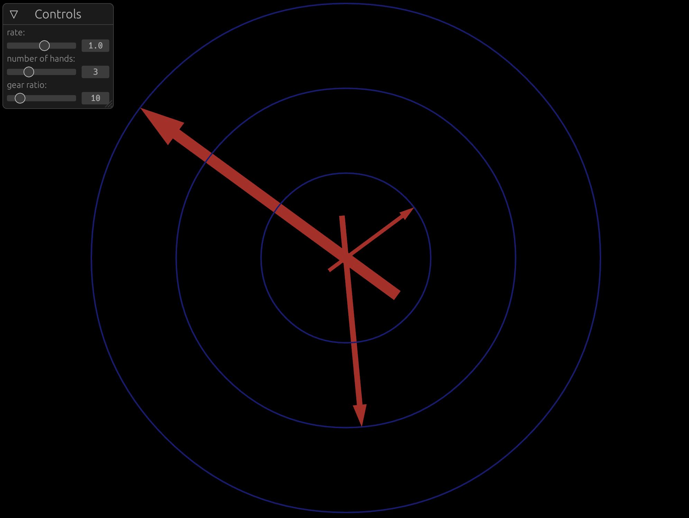

# clock

This is a fairly simple demo project using the [Nannou](https://nannou.cc) creative coding framework for rust. 

The user can adjust the clock's rate, number of hands and the ratio between hands.

